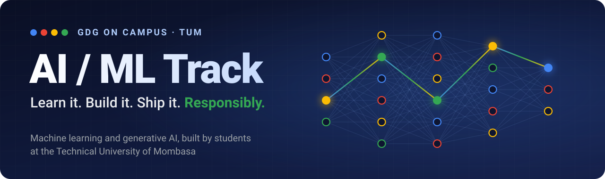
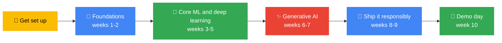
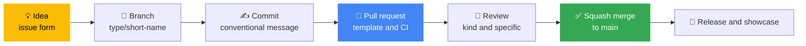

<div align="center">



<br/>


-FBBC04?style=for-the-badge&labelColor=555)

[](https://github.com/GDG-TUM/AI-ML-Track-GDG-on-Campus-TUM/actions/workflows/ci.yml)


[🚀 Getting Started](GETTING-STARTED.md) · [📅 Weekly Sessions](weekly-sessions/README.md) · [🧭 Learning Path](learning-path/README.md) · [🛠️ Projects](projects/README.md) · [🛡️ Responsible AI](docs/responsible-ai.md) · [📚 Resources](resources/README.md) · [❓ FAQ](FAQ.md)

</div>

---

## ✨ Why this track exists

AI is being built right now, and the people who shape it should include students from Mombasa. This track is where you go from *"I have heard of machine learning"* to *"I trained a model, tested it honestly, and shipped something people can use."*

We learn the way professionals work: version control, code review, reproducible experiments and honest evaluation. **Responsible AI is part of every session, not an extra at the end.**

| 🧠 Understand | 🔨 Build | 🛡️ Be responsible |
|---|---|---|
| Know *why* a model works, not just how to call it. We even train a neural network from scratch in NumPy. | Every member finishes with a public project, a model card and a demo. | Fairness, privacy and safety are checked on every project before demo day. |

**No machine learning experience is needed.** Some programming helps, and Week 1 is a gentle Python-for-data session. If you have never written code, tell us: we will pair you with a mentor and share a short pre-work list ([Stage 1](learning-path/01-foundations.md)).

> [!TIP]
> **Lost in this repo?** Click the **☰ outline button** at the top right of this page for a clickable table of contents. Every other page has a **← Back to AI/ML Track home** link at the top.

---

## 🧭 Start here: how to use this repo

### If you are new, follow these 5 steps

| Step | Do this | Where |
|:-:|---|---|
| **1** | Read this page (5 minutes) so you know what the track is | You are here |
| **2** | Complete the setup checklist: accounts, tools, 2FA | [GETTING-STARTED.md](GETTING-STARTED.md) |
| **3** | Make your first contribution by adding your profile | [members/](members/README.md) |
| **4** | Open [Week 1](weekly-sessions/week-01-welcome-and-python-for-data/README.md) and come to the session | [weekly-sessions/](weekly-sessions/README.md) |
| **5** | Share your plan with the chapter | [member-roadmaps](https://github.com/GDG-TUM/member-roadmaps) |

### Or jump straight to what you need

| I want to... | Go here |
|--------------|---------|
| **Set up my laptop (or use no laptop at all)** | [Getting Started](GETTING-STARTED.md) · [Compute guide](resources/compute-guide.md) |
| **See what happens each week** | [Weekly Sessions](weekly-sessions/README.md) |
| **Follow the full learning path** | [Learning Path](learning-path/README.md) |
| **See the semester plan and dates** | [Semester Roadmap](roadmap/semester-roadmap.md) |
| **Start or join a project** | [Projects](projects/README.md) · [Ideas](projects/ideas.md) |
| **Compete in a hackathon or Kaggle** | [Competitions](competitions/README.md) |
| **Check my model is fair, safe and honest** | [Responsible AI](docs/responsible-ai.md) · [Checklist](resources/responsible-ai-checklist.md) |
| **Look up a term** | [Glossary](resources/glossary.md) |
| **Find free resources and cheat sheets** | [Resources](resources/README.md) |
| **Understand how we work together** | [Workflow](docs/workflow.md) · [Contributing](CONTRIBUTING.md) · [Governance](GOVERNANCE.md) |
| **Run a session or maintain the repo** | [Session playbook](docs/session-playbook.md) · [Maintainers guide](docs/maintainers-guide.md) |
| **Ask a question** | [Open a question issue](https://github.com/GDG-TUM/AI-ML-Track-GDG-on-Campus-TUM/issues/new/choose) |

### Your journey through the track



### Jump around this page

[🎯 Goals](#goals) · [🧭 Learning path](#learning-path) · [🗓️ Roadmap](#roadmap) · [🛠️ Typical week](#typical-week) · [🚀 Projects](#projects) · [⚙️ How we work](#how-we-work) · [🖥️ Compute](#compute) · [👥 Roles](#roles) · [✅ Get involved](#involved) · [📈 Success](#success) · [⚠️ Good to know](#good-to-know) · [📬 Contact](#contact)

---

<a id="goals"></a>

## 🎯 Track goals for the 2026/27 academic year

By the end of the semester, every active member should be able to:

1. Explain what machine learning is, and when it is *not* the right tool
2. Load, clean and explore a dataset with Python (NumPy, pandas, matplotlib)
3. Train and **honestly evaluate** a model with scikit-learn (baselines, validation, no leakage)
4. Explain how a neural network learns, and fine-tune a pretrained one on a GPU
5. Build a small app on a large language model (prompting, retrieval, tool use)
6. Document a model with a **model card** and review a project for fairness, privacy and safety
7. Ship a working demo, and have at least one **public project** on GitHub to show employers

---

<a id="learning-path"></a>

## 🧭 Learning path

Six stages, each with its own page of topics, hands-on tasks and a checkpoint. [See the full learning path →](learning-path/README.md)

| Stage | Topics | Outcome | Read |
|-------|--------|---------|------|
| **1. Foundations** | Python for data, notebooks, Colab and Kaggle, maths intuition | You can explore a dataset | [Stage 1](learning-path/01-foundations.md) |
| **2. Core machine learning** | Supervised learning, scikit-learn, metrics, overfitting, leakage | A model you can honestly defend | [Stage 2](learning-path/02-core-ml.md) |
| **3. Deep learning** | Neural networks, backprop, CNNs, transfer learning, GPUs | A trained neural network | [Stage 3](learning-path/03-deep-learning.md) |
| **4. Generative AI** | LLMs, prompting, the Gemini API, RAG, agents | An AI-powered prototype | [Stage 4](learning-path/04-generative-ai.md) |
| **5. Responsible AI** | Fairness, privacy, safety, model cards, red teaming | A project you can explain and defend | [Stage 5](learning-path/05-responsible-ai.md) |
| **6. Ship it** | Reproducibility, testing, apps, containers, monitoring | A demo anyone can open | [Stage 6](learning-path/06-ship-it.md) |

---

<a id="roadmap"></a>

## 🗓️ Semester roadmap (draft: October to December 2026)

Click a week to open its agenda, notebook and take-home challenge. [Full roadmap →](roadmap/semester-roadmap.md)

| Week | Date (draft) | Focus | What we do |
|------|--------------|-------|-----------|
| Launch | 5 to 11 Oct | Repo goes live | Core team onboarding, labels synced, board set up |
| **[1](weekly-sessions/week-01-welcome-and-python-for-data/README.md)** | Wed 14 Oct | Welcome and Python for data | What is ML? NumPy, pandas and charts in Colab |
| **[2](weekly-sessions/week-02-your-first-model/README.md)** | Wed 21 Oct | Your first model | Train a digit reader, beat a baseline |
| **[3](weekly-sessions/week-03-evaluate-honestly/README.md)** | Wed 28 Oct | Evaluate honestly | Overfitting, leakage, the accuracy trap; first Kaggle entry |
| **[4](weekly-sessions/week-04-neural-networks-from-scratch/README.md)** | Wed 4 Nov | Neural networks from scratch | Backprop in NumPy; project pitches |
| **[5](weekly-sessions/week-05-deep-learning-in-practice/README.md)** | Wed 11 Nov | Deep learning in practice | Transfer learning on a free GPU; project proposals due |
| **[6](weekly-sessions/week-06-language-models-and-gemini/README.md)** | Wed 18 Nov | Language models and Gemini | Tokens, prompting, the Gemini API |
| **[7](weekly-sessions/week-07-rag-and-agents-study-jam/README.md)** | Wed 25 Nov | RAG and agents study jam | Build a question-answering bot with sources; Hack Night |
| **[8](weekly-sessions/week-08-responsible-ai/README.md)** | Wed 2 Dec | Responsible AI | Model cards, fairness slices, red-team swap |
| **[9](weekly-sessions/week-09-from-notebook-to-app/README.md)** | Wed 9 Dec | From notebook to app | Tests, a demo app, deployment; project clinic |
| **[10](weekly-sessions/week-10-demo-day/README.md)** | Wed 16 Dec | Demo day | Project demos, retrospective, plan for next semester |

> [!NOTE]
> Dates are a starting plan. We will adjust around exams and campus events and post changes in the track channel. The Cloud Track meets on Mondays, so you can do both.

---

<a id="typical-week"></a>

## 🛠️ How a typical week works

- **One session per week** (hands-on, around 90 minutes: short explanation, then build together in pairs)
- **A notebook you can run in your browser**, with nothing to install
- **Take-home challenge**, small enough to finish in 1 to 2 hours
- **A "Responsible AI moment"** in every session: five minutes on who could be affected
- **Notes and code pushed to this repo** after each session
- **Help channel** for questions. No question is too basic.

**Missed a session?** Open that week's folder in [weekly-sessions/](weekly-sessions/README.md), run the notebook, finish the challenge and ask in the track channel.

---

<a id="projects"></a>

## 🚀 Projects

From week 4, members pitch ideas and form small teams (3 to 5 people). Every team builds a project that is **reproducible, evaluated honestly, reviewed for responsible AI and demoed** on demo day.

- A crop-disease photo classifier for smallholder farmers
- A Swahili text tool: sentiment, translation or a question-answering bot
- A campus study assistant that answers from your own course notes, with citations
- A forecast built from open Kenyan data (prices, rainfall, transport)
- A model audit: take an existing public model and test it for bias and failure modes

| | |
|---|---|
| 📖 [Project guide](projects/README.md) | What every project needs and how to start |
| 💡 [Project ideas](projects/ideas.md) | Beginner, intermediate, advanced and local-impact ideas |
| 🧱 [Starter template](projects/_template/README.md) | A tested project skeleton with model card and data card |
| 🌟 [Showcase](projects/showcase.md) | Finished projects from members |
| 🚀 [Propose a project](https://github.com/GDG-TUM/AI-ML-Track-GDG-on-Campus-TUM/issues/new/choose) | Open a *Project proposal* issue |

---

<a id="how-we-work"></a>

## ⚙️ How we work

We run this track like a small open-source project, using the same conventions you will meet in industry. Everything is on GitHub, in the open.



| Practice | What it means here | Details |
|---|---|---|
| **Conventional Commits** | `feat(curriculum): add week 6 notebook` | [Contributing](CONTRIBUTING.md) |
| **Trunk-based, short branches** | `main` is always releasable; branch, change one thing, merge | [Workflow](docs/workflow.md) |
| **Automated checks** | Lint, notebook execution, link and structure checks on every PR | [CI](.github/workflows/ci.yml) |
| **Code owners and review** | Every change gets a kind, specific review | [Governance](GOVERNANCE.md) |
| **Decision records** | Important choices are written down so the next cohort knows why | [Decisions](docs/decisions/README.md) |
| **Semantic releases** | A tagged release per milestone, with generated notes | [Changelog](CHANGELOG.md) |

---

<a id="compute"></a>

## 🖥️ You do not need a GPU

Everything in the track runs **free, in your browser**, on [Google Colab](https://colab.research.google.com) or [Kaggle Notebooks](https://www.kaggle.com/code). An old laptop and a phone hotspot are enough. Data bundles are expensive, so we pick small datasets, share files over campus Wi-Fi and show you how to work offline. See the [compute guide](resources/compute-guide.md).

---

<a id="roles"></a>

## 👥 Roles in the track

| Role | Responsibility |
|------|---------------|
| **Track Lead** | Plans the semester, runs sessions, maintains this repo, supports teams |
| **Maintainers** | Review pull requests, triage issues, help run sessions |
| **Mentors (invited)** | Senior students, alumni or industry guests who coach project teams and review work |
| **Members** | Attend, complete challenges, build a project, help each other |

Full details, including how to become a maintainer, are in [GOVERNANCE.md](GOVERNANCE.md).

---

<a id="involved"></a>

## ✅ How to get involved

1. Make sure you have joined the [**GDG-TUM** GitHub organization](https://github.com/GDG-TUM)
2. Add your personal plan in the [**member-roadmaps**](https://github.com/GDG-TUM/member-roadmaps) repo (open a *Member Roadmap* issue)
3. Make your first contribution by [adding your profile](members/README.md)
4. Come to the next session. Dates are posted in the track channel and on the [chapter board](https://github.com/orgs/GDG-TUM/projects/1).
5. Read the [contributing guide](CONTRIBUTING.md) before your first pull request

**New to GitHub?** That is fine. The [Cloud Track](https://github.com/GDG-TUM/Cloud-Track-GDG-on-Campus-TUM) teaches the whole flow in its Week 2, and the [Git cheat sheet](resources/cheatsheets/git-for-ml.md) is there while you learn.

---

<a id="success"></a>

## 📈 How we will know the track is working

- Members who train **and honestly evaluate** at least one model
- Projects shown at demo day, each with a model card
- Public repos and merged pull requests from members
- Session attendance and member feedback after each phase
- Members who go on to Kaggle or Zindi competitions, hackathons, internships or research

Tell us how we are doing: [give session feedback](https://github.com/GDG-TUM/AI-ML-Track-GDG-on-Campus-TUM/issues/new/choose).

---

<a id="good-to-know"></a>

## ⚠️ Good to know

> [!WARNING]
> **Never commit API keys, tokens, passwords or personal data.** That includes keys pasted into a notebook and data about real people (classmates, patients, customers). If it happens, tell a maintainer immediately so the secret can be revoked. See the [security policy](SECURITY.md).

- **Models can be wrong, biased or unsafe.** We test for that on purpose. Read our [Responsible AI guide](docs/responsible-ai.md).
- **AI tools are welcome** (including for coding) as long as you understand what you submit and say so in your pull request. See [Contributing](CONTRIBUTING.md#ai-assisted).
- **Be kind.** We follow the [Code of Conduct](CODE_OF_CONDUCT.md).
- **Free tiers change.** Always check the current limits of Colab, Kaggle and the Gemini API before you rely on them.
- **Cannot attend a session?** Everything is in this repo. Work through the week's folder at your own pace.

---

## 🗂️ Repo map

```text
AI-ML-Track-GDG-on-Campus-TUM/
├── README.md                  ← you are here
├── GETTING-STARTED.md         ← setup checklist
├── FAQ.md                     ← common questions
├── CONTRIBUTING.md            ← how to contribute (conventions live here)
├── GOVERNANCE.md              ← roles and decision making
├── CODE_OF_CONDUCT.md · SECURITY.md · SUPPORT.md · CHANGELOG.md · LICENSE
├── roadmap/                   ← semester plan and dates
├── learning-path/             ← 6 stages from Python to shipping
├── weekly-sessions/           ← one folder per week (agenda, notebook, challenge)
├── projects/                  ← guide, ideas, template, showcase
├── competitions/              ← hackathons, Kaggle, Zindi
├── members/                   ← add your profile (your first pull request)
├── resources/                 ← free resources, glossary, cheat sheets, checklists
├── docs/                      ← workflow, playbooks, responsible AI, decisions
├── scripts/                   ← repo checks used by CI
├── assets/                    ← banner and social preview
└── .github/                   ← issue forms, PR template, workflows, labels
```

**Folder links:** [roadmap](roadmap/semester-roadmap.md) · [learning-path](learning-path/README.md) · [weekly-sessions](weekly-sessions/README.md) · [projects](projects/README.md) · [competitions](competitions/README.md) · [members](members/README.md) · [resources](resources/README.md) · [docs](docs/README.md)

---

<a id="contact"></a>

## 📬 Contact

| | |
|---|---|
| 🏠 **GitHub organization** | [github.com/GDG-TUM](https://github.com/GDG-TUM) |
| 📋 **Chapter project board** | [GDG-TUM Projects](https://github.com/orgs/GDG-TUM/projects/1) |
| ☁️ **Sister track** | [Cloud Track](https://github.com/GDG-TUM/Cloud-Track-GDG-on-Campus-TUM) |
| 💼 **LinkedIn** | [GDG on Campus TUM](https://www.linkedin.com/company/gdg-on-campus-tum/) |
| ✉️ **Email** | [gdgtum@gmail.com](mailto:gdgtum@gmail.com) |
| 💬 **Questions about this track** | [Open an issue](https://github.com/GDG-TUM/AI-ML-Track-GDG-on-Campus-TUM/issues/new/choose) |

📄 Licensed under the [MIT License](LICENSE). AI/ML Track Lead: Lewis Kagiri ([@10kwise](https://github.com/10kwise)).

<div align="center">

<a href="#">⬆️ Back to top</a>

*Learn. Build. Ship. Responsibly. Together.* 🤖

</div>
