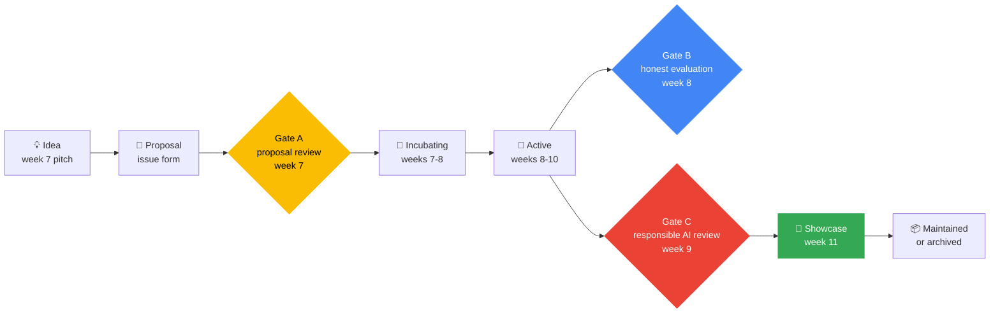

[← Back to AI/ML Track home](../README.md)

# 🚀 Project Lifecycle

Every **Phase 2 team project** follows the same path, so teams know what is expected and reviewers know what to look for. The path has **three gates** that protect learners and the people their models will touch.

## The stages

| Stage | When | What happens | You leave when |
|---|---|---|---|
| 💡 **Idea** | Week 7 | A 60-second pitch. Find teammates. | At least 3 people are interested |
| 📝 **Proposal** | Week 7 | Open a [Project proposal](https://github.com/GDG-TUM/AI-ML-Track-GDG-on-Campus-TUM/issues/new/choose) issue. Two maintainers review it within a few days. | **Gate A** passes |
| 🌱 **Incubating** | Weeks 7 to 8 | Create your repo from the [starter template](../projects/_template/README.md). Get data. Get a **baseline** running. Start the data card. | A baseline runs end to end |
| 🔨 **Active** | Weeks 8 to 10 | Iterate. Weekly check-in with your mentor. Keep the board current. | **Gates B and C** pass |
| 🎤 **Showcase** | Week 11 | Demo, README, model card, short write-up. Add yourselves to the [showcase](../projects/showcase.md). | Demo day is done |
| 📦 **Maintained or archived** | After | Keep going, or write "what we learned" in the README and archive the repo. Either way, the work stays findable. | n/a |

## The three gates

### Gate A: proposal review (week 7)

Two maintainers check that:

- [ ] The **problem and audience** are clear, and ML is a sensible tool for it
- [ ] The **data** exists, is legal to use and has a licence we can name
- [ ] There is a **success metric** and a **baseline** to beat
- [ ] The "who could be harmed?" answer is thoughtful
- [ ] The scope fits **about four weeks of part-time work**
- [ ] The team has a mentor, or one is assigned

Outcomes: **Approved**, **Approved with conditions** (for example "no scraping, use this public dataset"), or **Needs changes** with reasons and a path forward. Nobody is rejected, just helped to a better version.

### Gate B: honest evaluation (week 8)

- [ ] A **baseline** and your model are compared on the **same split**
- [ ] The test set was used **once**, at the end
- [ ] No data leakage (see [Week 3](../weekly-sessions/week-03-evaluate-honestly/README.md))
- [ ] You report more than accuracy, and you looked at real mistakes
- [ ] Results are reproducible (seeds, environment, one command)

### Gate C: responsible AI review (week 9)

Described in the [Responsible AI guide](responsible-ai.md#review). You complete the [checklist](../resources/responsible-ai-checklist.md), write the **model card** and **data card**, and swap with another team for a short red-team.

## Team roles (3 to 5 people)

Roles can be shared or rotated in a small team. **Everyone codes and everyone reviews.**

| Role | Looks after |
|---|---|
| **Project lead** | The board, the weekly check-in, scope and keeping to time |
| **Data lead** | Collecting and cleaning data, the data card, licences and consent |
| **Modeling lead** | The baseline, experiments, evaluation and honest reporting |
| **Delivery lead** | The demo app, tests, deployment and the README |
| **Responsible AI reviewer** | The checklist, the model card and the red-team questions |

## ✅ Definition of done

A project is ready for demo day when it has:

- [ ] A **public repo** (in the GDG-TUM org or a member's account) with a clear README from the [template](../projects/project-template.md)
- [ ] A **reproducible environment**: `requirements.txt`, set seeds, and one command that reruns the main result
- [ ] A **baseline** and an **honest evaluation** against it
- [ ] A **model card** and a **data card**, filled in truthfully
- [ ] A completed **responsible AI checklist** and review
- [ ] **Tests** that run in CI (even a few small ones)
- [ ] A **demo**: a live app, a hosted demo or a short recording
- [ ] **No secrets, no personal data, no large files** in the repo
- [ ] A **licence** (MIT by default) and credits for data and tools
- [ ] A short **write-up** of what the team learned, including what did not work

## When a team gets stuck

It happens to every team. A stuck team is not a failed team.

1. Tell your mentor early. A short, honest message is enough.
2. **Shrink the scope.** A finished small project beats an unfinished big one.
3. Rebalance roles, or ask for a helper for a session.
4. If a teammate has gone quiet, check in kindly first. If nothing changes, tell the Track Lead, who will help the team re-plan.

## Credit and ownership

- Everyone who contributes is credited in the README, using their GitHub name.
- Projects are MIT-licensed by default. Data and models carry **their own licences**, so check and state them.
- Commits, issues and pull requests in the project repo are your portfolio. Keep them tidy and kind.

## After demo day

- **Keep going:** the team commits to maintaining it, and says so in the README.
- **Archive:** update the README with "what we learned", add the final state to the showcase, and archive the repository. This keeps old work visible without implying it is maintained.
