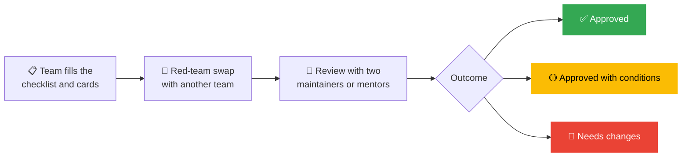

[← Back to AI/ML Track home](../README.md)

# 🛡️ Responsible AI

**Models affect real people.** A classifier that is wrong 5% of the time is wrong for *someone*, and that someone is rarely the person who built it. Even a student project can quietly decide who gets seen, believed or helped. We want every member to leave this track knowing how to build things that are useful **and** fair, private, safe and honest.

Responsible AI is not a lecture in Week 8. It is a **habit in every session**, a **question in every proposal** and a **gate every project passes** before demo day.

> [!NOTE]
> This guide is a practical working agreement for our projects, not legal advice. Our practices draw on [Google's responsible AI practices](https://ai.google/responsibility/responsible-ai-practices/), the [People + AI Guidebook](https://pair.withgoogle.com/guidebook/) and the model card and datasheet research listed at the end.

---

## 🧭 Our principles

| Principle | What it means | What we do in practice |
|---|---|---|
| **Purpose** | Build things that help, and check that ML is the right tool | Every proposal answers: *Who is this for? Is there a simpler way? Who could be harmed?* |
| **People and consent** | Data is about real people | Use public, synthetic or consented data. Never commit personal data. Credit and respect data sources. |
| **Fairness** | A model should work for the people it serves, not just the average | Evaluate on **slices** (language, gender, region, device, lighting, accent), not just overall. Report gaps honestly. |
| **Transparency** | People should know what a system is and what it can and cannot do | Write a **model card** and **data card**. Disclose AI-generated content. Cite sources in LLM apps. |
| **Safety and reliability** | Plan for the model being wrong | Test failure modes, set limits, add human oversight where stakes are high, treat prompts as untrusted input. |
| **Accountability** | Someone is answerable for what we ship | Every project has named owners. Anyone can raise a concern, and the project pauses until it is heard. |

---

## 📏 Rules for every track project

### You must

- [ ] Answer **"Who could be harmed if this is wrong?"** in your proposal, honestly
- [ ] Use only data you have the **right to use**, and state its licence and source
- [ ] Evaluate against a **baseline** and report **more than accuracy**, including per-group results where groups exist
- [ ] Write a [model card and data card](../projects/_template/MODEL_CARD.md) and keep them truthful
- [ ] Complete the [responsible AI checklist](../resources/responsible-ai-checklist.md) and pass the **Week 8 review**
- [ ] For LLM apps: **cite sources**, show that output is AI-generated, and defend against [prompt injection](../SECURITY.md)
- [ ] Credit the datasets, models and people you build on

### You must not

- ❌ Commit **personal data** (photos of people, names, messages, grades, health or financial records) to any repository
- ❌ Build tools to **identify, track or profile individuals** without their clear consent
- ❌ Build **deepfakes**, impersonation tools, or systems to produce disinformation or harassment
- ❌ Build tools designed to **cheat** in exams or assessments
- ❌ Deploy a system that makes **real decisions about people** (see the table below)
- ❌ Scrape data in ways that break a website's terms or people's reasonable expectations
- ❌ Hide the fact that content or code was AI-generated

---

## ⚠️ High-stakes domains

Some areas deserve extra care because mistakes cost people dearly. **Prototypes and learning projects are welcome. Deployment to real decisions is not.**

| Domain | Examples | Extra requirements |
|---|---|---|
| **Health** | Symptom checkers, scan analysis | Clear "not medical advice" disclaimer, validated data, never presented as diagnosis |
| **Money** | Credit scoring, fraud flags, loan eligibility | Bias analysis by group, human review, no real customer data |
| **Legal and rights** | Rights assistants, document analysis | Cite official sources, say it is not legal advice, show uncertainty |
| **Education** | Grading, plagiarism or AI detection, admissions | No automated decisions about real students, and awareness that AI detectors are unreliable |
| **Employment** | CV screening, hiring tools | Not used on real applicants. Examine bias thoroughly. |
| **Safety and security** | Surveillance, face recognition, weapons-adjacent | Needs explicit lead approval, and usually will not be approved |
| **Children** | Anything for or about minors | Needs explicit lead approval and strong privacy protection |

If your idea touches one of these, say so in the proposal. We will help you find a safe and valuable version of it, such as an *audit* of how a public model behaves.

---

## 🔍 The responsible AI review (Gate C, Week 8)

Every project goes through the same short, friendly review. It is a **conversation to improve the project**, not an exam.

1. **Prepare.** The team completes the [checklist](../resources/responsible-ai-checklist.md), the model card and the data card.
2. **Red-team swap.** Teams swap projects and spend 20 minutes trying to break each other's work: odd inputs, unfair slices, prompt injection, misuse. Findings go in an issue.
3. **Review.** Two maintainers or mentors read the cards and findings and talk with the team for 15 minutes.
4. **Outcome.** *Approved*, *Approved with conditions* (written, with a date to fix them), or *Needs changes* (with reasons and help). Teams that need changes get a second review within a week.

**Appeals:** if a team disagrees, the Track Lead decides after hearing both sides.

---

## 🧰 Tools and templates

| Tool | Where |
|---|---|
| Model card template | [`projects/_template/MODEL_CARD.md`](../projects/_template/MODEL_CARD.md) |
| Data card template | [`projects/_template/DATA_CARD.md`](../projects/_template/DATA_CARD.md) |
| Responsible AI checklist | [`resources/responsible-ai-checklist.md`](../resources/responsible-ai-checklist.md) |
| Slice evaluation, model cards, red-teaming | [Week 8 session](../weekly-sessions/week-08-responsible-ai/README.md) |
| Learning path stage | [Stage 5: Responsible AI](../learning-path/05-responsible-ai.md) |

---

## 🇰🇪 Data protection in Kenya

If your project uses personal data about people in Kenya, the **Data Protection Act, 2019** applies. In plain terms, and as a starting point rather than legal advice:

- Collect **only what you need** (data minimisation) and only for a stated purpose
- Get **clear, informed consent**, and let people withdraw it
- **Keep it secure**, and don't keep it longer than needed
- People have **rights** over their data, including to see and correct it

The regulator is the [Office of the Data Protection Commissioner](https://www.odpc.go.ke). **If in doubt, talk to a maintainer before you collect anything.** The easiest path is to use public, synthetic or properly licensed datasets.

---

## ✨ Generative AI specifics

- **Hallucination is normal.** Models can state falsehoods fluently. Ground answers in sources (RAG), show citations and verify what matters.
- **Bias shows up in outputs.** Test prompts across names, languages and groups.
- **Copyright and licences matter.** Don't present generated or copied material as your own, and check the licence of what you feed in.
- **Don't hide AI.** Label AI-generated content and say when a person is talking to a bot.
- **Keep humans in the loop** for anything that sends, buys, deletes or decides.
- **Think about cost and footprint.** Prefer smaller models and shorter training runs. Don't run big jobs just because you can.
- **African languages are underrepresented** in many models. Test honestly, and consider contributing to community efforts such as [Masakhane](https://www.masakhane.io).

---

## 🚨 Raising a concern

Anyone, at any time, can raise a concern about a project, a dataset or a session.

- Talk to your **mentor** or a **maintainer**, or email [gdgtum@gmail.com](mailto:gdgtum@gmail.com) for something private.
- **Stop the line.** If someone raises a concern about potential harm, the project pauses that part of the work until a maintainer has looked at it. Raising a concern in good faith is always welcome and never penalised.

---

## 📖 Further reading

- [Model Cards for Model Reporting](https://arxiv.org/abs/1810.03993) (Mitchell et al., 2019)
- [Datasheets for Datasets](https://arxiv.org/abs/1803.09010) (Gebru et al.)
- [Fairness and Machine Learning](https://fairmlbook.org) (Barocas, Hardt and Narayanan), free online
- [Machine Learning Crash Course: Fairness](https://developers.google.com/machine-learning/crash-course/fairness)
- [People + AI Guidebook](https://pair.withgoogle.com/guidebook/)
- [Google's responsible AI practices](https://ai.google/responsibility/responsible-ai-practices/)
