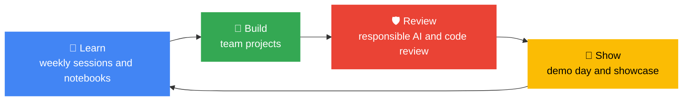
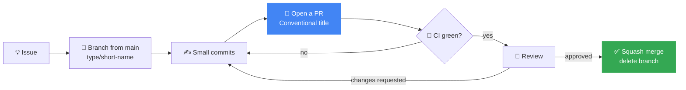

[← Back to AI/ML Track home](../README.md)

# ⚙️ How We Work

This page describes how work flows through the track, from an idea to a merged change to a demo on stage. Everything here is a **convention, not a cage**. It exists so that a newcomer, a mentor and next year's lead can all predict what happens next.

[The big picture](#big-picture) · [Weekly rhythm](#weekly-rhythm) · [Issues](#issues) · [Branches and PRs](#prs) · [Review](#review) · [CI](#ci) · [Project board](#board) · [Releases](#releases) · [Definitions of done](#done) · [Communication](#communication) · [Rituals](#rituals)

---

## 🗺️ The big picture

The track runs on four loops that feed each other. Each loop has a home in this repo.

| Thing | Where it happens | Who owns it |
|---|---|---|
| Planning each phase | [`roadmap/`](../roadmap/semester-roadmap.md) and the [chapter board](https://github.com/orgs/GDG-TUM/projects/1) | Track Lead |
| Running a session | `weekly-sessions/week-NN-*` and the [session playbook](session-playbook.md) | The session host |
| Proposing a session or project | An [issue form](https://github.com/GDG-TUM/AI-ML-Track-GDG-on-Campus-TUM/issues/new/choose) | The proposer |
| Changing anything in the repo | A pull request | The author, with a reviewer |
| Asking for help | A question issue or the track channel | Anyone |
| Making an important decision | An issue, then a [decision record](decisions/README.md) | Track Lead, after consulting maintainers |
| Reviewing a project for risk | The [responsible AI review](responsible-ai.md#review) in Week 9 | Maintainers and mentors |

---

## 📅 The weekly rhythm

Sessions are on Wednesdays (draft). The rest of the week is built around them.

| When | What happens | Who |
|---|---|---|
| **Thu to Sun before** | Host finishes the notebook and opens a **draft PR** from the [session template](../weekly-sessions/_template/README.md) | Session host |
| **Mon** | Agenda posted in the track channel. New issues triaged. | Lead and maintainers |
| **Tue** | **Dry run**: a helper runs the notebook on a *fresh* Colab, start to finish | Host and helper |
| **Wed** | **The session** | Everyone |
| **Thu** | **Session notes PR** merged within 48 hours. Feedback link shared. | Host |
| **Fri** | 20-minute maintainer sync: triage, board, blockers, next week | Maintainers |
| **Weekend** | Take-home challenge. Members help each other in the channel. | Members |

Detailed run of show: [session playbook](session-playbook.md).

---

## 🎟️ Issues: the front door

Every piece of work starts as an issue, so nothing lives only in someone's head. Use the **issue forms**: they ask the right questions and apply labels automatically. Blank issues are turned off on purpose.

| Form | Use it to | Labels applied |
|---|---|---|
| 🐛 Something is broken | Report a broken link, notebook or explanation | `bug`, `status: needs-triage` |
| ❓ Ask a question | Get unstuck | `question` |
| 💬 Session feedback | Tell us how a session went | `feedback` |
| 🎤 Propose a session | Suggest a session, study jam or talk | `session`, `status: proposal` |
| 🚀 Project proposal | Pitch a team project | `project`, `status: proposal` |
| 📚 Suggest a resource | Share a learning resource | `resource` |

### Labels

Labels are defined in one file, [`.github/labels.yml`](../.github/labels.yml), and synced by a workflow. Change them with a pull request, not in the UI.

| Prefix | Meaning | Examples |
|---|---|---|
| *(none)* | The kind of thing | `bug`, `enhancement`, `question`, `documentation` |
| `area:` | Which part of the repo | `area: sessions`, `area: notebooks`, `area: responsible-ai` |
| `level:` | Who it suits | `level: beginner`, `level: advanced` |
| `status:` | Where it is in its life | `status: needs-triage`, `status: proposal`, `status: in-progress`, `status: blocked` |
| *(community)* | Invitations | `good first issue`, `help wanted` |

### Triage (maintainers, within 3 days)

1. Is it clear? If not, ask and add `status: needs-info`.
2. Is it a duplicate? Link and close with `duplicate`.
3. Add an `area:` and a `level:` label, and remove `status: needs-triage`.
4. If a newcomer could do it, add `good first issue` and a short hint on where to start.
5. Link it to the right [board](https://github.com/orgs/GDG-TUM/projects/1) column.

### Claiming work

Comment on the issue to claim it, and a maintainer assigns you. Silent for two weeks? We gently free it up. Items marked `status: in-progress` or `pinned` are never closed as stale.

---

## 🌿 Branches, commits and pull requests

We use **trunk-based development**: `main` is always releasable, and everyone works in small, short-lived branches.

| Rule | Why |
|---|---|
| **Branch names:** `type/short-description` | You can tell what a branch is for at a glance |
| **PR titles follow [Conventional Commits](https://www.conventionalcommits.org)** | We squash-merge, so the PR title *is* the commit on `main` and feeds the release notes |
| **One PR does one thing** | Small PRs get faster, better reviews |
| **Open a draft PR early** | Early feedback beats a big surprise at the end |
| **Squash and merge only** | `main` stays a clean, readable list of changes |
| **Delete the branch after merging** | No clutter |
| **Never force-push to `main`** | History is shared |

Details and examples are in [CONTRIBUTING.md](../CONTRIBUTING.md).

---

## 👀 Review

- **Who reviews:** [CODEOWNERS](../.github/CODEOWNERS) asks the right people automatically.
- **How many approvals:** one for content, **two** for governance, CI or security files.
- **No self-approval.** If no other maintainer is available after 3 days, the lead may merge a trivial fix and must say so in the PR.
- **How fast:** a first response **within 3 days**. We are students, so please be patient, and ping in the channel if it has been longer.
- **How to comment:** be kind and specific. Prefix small suggestions with `nit:` and questions with `question:`. Critique the work, never the person.
- **Authors** resolve each conversation they have addressed, and re-request review after pushing changes.
- **Approve when it is good enough**, not when it is perfect. We can always improve it later.

Anyone can review, not just maintainers. It is one of the fastest ways to learn.

---

## 🤖 CI: what runs and what to do when it is red

CI runs on every pull request and on `main`. A single required check, **CI passed**, summarises the rest.

| Check | What it protects | If it fails, run locally |
|---|---|---|
| **Repo structure and links** | Broken links, badly named week folders, missing sections, malformed member profiles, notebooks committed with outputs | `make repo-check` |
| **Lint and format (Ruff)** | Consistent, bug-free Python and notebooks | `make format` |
| **Lint (Markdown)** | Consistent documentation | `make mdlint` |
| **Notebooks run top to bottom** | Every notebook still works on a fresh kernel | `make notebooks` |
| **Starter project template** | The template keeps working for new teams | `make template-test` |
| **Conventional Commit title** | Readable history and automatic release notes | Edit the PR title |

`make check` runs the lot. Read the first error, fix it, push again. A red check is feedback, not failure.

**Once a week** a separate job checks external links and opens an issue when something has rotted. Dependabot opens small PRs to keep tools and Actions up to date.

---

## 📋 The project board

We use the chapter's [GitHub Project](https://github.com/orgs/GDG-TUM/projects/1) so work across tracks stays visible in one place.

| Column | Meaning |
|---|---|
| **Backlog** | Triaged ideas and issues, not yet planned |
| **Ready** | Clear, small, someone could start today |
| **In progress** | Someone is on it (assigned) |
| **In review** | A PR is open |
| **Done** | Merged or closed |

**Suggested fields:** Track (AI/ML), Week, Level, Area. **Suggested views:** *This semester* (board), *Proposals* (filtered to `status: proposal`) and *Sessions* (table sorted by week). Turn on the built-in project workflows so new issues are added automatically and closed ones move to **Done**.

---

## 🏷️ Releases and the changelog

We use [Semantic Versioning](https://semver.org) in a way that suits a curriculum:

| Bump | When | Example |
|---|---|---|
| **MAJOR** | New academic-year curriculum, or a restructure that breaks links | `2.0.0` |
| **MINOR** | New sessions, notebooks, projects or resources | `1.1.0` |
| **PATCH** | Fixes and small clarifications | `1.0.1` |

[Release Drafter](../.github/release-drafter.yml) keeps a **draft release** up to date from merged PR titles. A maintainer publishes it at the end of each phase. Tags give each cohort a **stable snapshot**, so old links keep working. The how-to is in the [maintainers guide](maintainers-guide.md#releases).

---

## ✅ Definitions of done

**A session is done when:**

- [ ] The notebook runs on a fresh Colab, start to finish
- [ ] Objectives, agenda, take-home challenge and a Responsible AI moment are written
- [ ] Notes, slides and links are added by PR within 48 hours
- [ ] The glossary has any new terms
- [ ] Feedback has been collected

**A project is done when** it meets the [project definition of done](project-lifecycle.md#done): reproducible, honestly evaluated, reviewed for responsible AI, documented with a model card, and demoed.

**A pull request is done when:** CI is green, it is reviewed and approved, conversations are resolved, and the PR title is a clean Conventional Commit.

---

## 💬 Communication

| Use | For | Why |
|---|---|---|
| **Issues** | Work: bugs, proposals, tasks | A durable, searchable record |
| **Pull requests** | Discussing a specific change | Context stays with the code |
| **Discussions** | Ideas, open questions, show-and-tell | Keeps issues for work |
| **Track channel** | Day-to-day chat, reminders, quick help | Fast and friendly |
| **Email** | Anything private or sensitive | [gdgtum@gmail.com](mailto:gdgtum@gmail.com) |

**Default to public.** If you have a question, someone else has it too. Ask where others can see the answer. Keep personal, sensitive and conduct matters private.

---

## 🔁 Rituals

| Ritual | When | Length | Purpose |
|---|---|---|---|
| **Maintainer sync** | Weekly, Fridays | 20 min | Triage, board, blockers, next week |
| **Session dry run** | Tuesday before each session | 30 min | No surprises on the day |
| **Project check-in** | Every team, weekly | 15 min | Progress, blockers, next step, with a mentor |
| **Member check-in** | Monthly | 15 min | Nobody falls behind quietly |
| **Phase 1 retrospective** | Week 6 | 15 min | What helped, what got in the way; finalise Phase 2 |
| **Retrospective** | Week 11 | 45 min | What worked, what to change, what to keep |
| **Handover** | End of the academic year | 60 min | See the [handover checklist](maintainers-guide.md#handover) |
