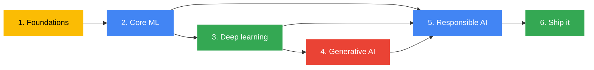

[← Back to AI/ML Track home](../README.md)

# 🧭 Learning Path

Six stages that take you from "what is machine learning?" to training, evaluating, reviewing and shipping a real project.

| Stage | Topic | Phase | Weeks | Read |
|-------|-------|-------|-------|------|
| 1 | Foundations | 1 | 1 | [01-foundations.md](01-foundations.md) |
| 2 | Core machine learning | 1 | 2, 3 | [02-core-ml.md](02-core-ml.md) |
| 3 | Deep learning | 1 | 4, 5 (showcase in 6) | [03-deep-learning.md](03-deep-learning.md) |
| 4 | Generative AI | 2 | 7, 8 | [04-generative-ai.md](04-generative-ai.md) |
| 5 | Responsible AI | 2 | 9 (and a moment every week) | [05-responsible-ai.md](05-responsible-ai.md) |
| 6 | Ship it | 2 | 10, 11 | [06-ship-it.md](06-ship-it.md) |

> [!NOTE]
> Stage 5 is a stage of its own **and** a thread through all the others. Every session includes a five-minute Responsible AI moment.

## How to use this path

1. Read the stage page, then do the matching weekly session.
2. Finish each stage's **checkpoint** before moving on.
3. Stuck for more than 30 minutes? Ask. That is what the track is for.
4. Add what you learn back to the repo (notes, fixes, better links).

## Self-paced learners

If you joined late, work through the stages in order. Each one lists free resources, and the [weekly sessions](../weekly-sessions/README.md) hold the hands-on notebooks. Use the [glossary](../resources/glossary.md) whenever a word is new.

## Where this track meets the Cloud Track

Machine learning gets real when it runs somewhere other people can use it. The [Cloud Track](https://github.com/GDG-TUM/Cloud-Track-GDG-on-Campus-TUM) covers containers, Cloud Run, CI/CD and AI agents on Google Cloud. Stage 6 builds directly on it, and members of both tracks are encouraged to team up on projects.
