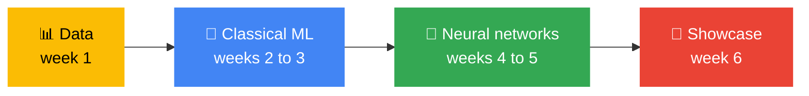

[← Back to AI/ML Track home](../README.md)

# 🗓️ Track Roadmap

The track runs in **phases**. Each phase has a clear finish line, so you always know what you are working towards, and what you tell us at the end of one phase shapes the next.

Weeks are counted from the first session. Session times and venues are posted in the track channel. Curious where all this leads? Read [the vision](../vision/README.md).

| Phase | Weeks | Theme | Fields | Finish line |
|---|---|---|---|---|
| **1** | 1 to 6 | **How machines learn** | Data · Classical ML · Neural networks | You can train a model, evaluate it honestly and explain *why* it works |
| **2** (draft) | 7 to 11 | **Build with AI** | Generative AI · Responsible AI · Shipping | Team projects demoed on demo day |
| Later | n/a | Ideas, not commitments | See [looking ahead](#looking-ahead) | n/a |

---

## 🌱 Phase 1: How machines learn (6 weeks)

### Why we start here

*"Why learn this when I can just call Gemini?"* It is a fair question. Here is the answer, and it is the point of the whole phase.

1. **Every AI system is built from the same few pieces.** Data, a model, a loss, an optimiser and an evaluation. A large language model is a neural network (Week 4), trained by gradient descent on a huge dataset (Week 1), that still has to be evaluated honestly (Week 3). Learn the pieces once and every new tool you meet makes sense.
2. **Tools expire, ideas do not.** Libraries and model names change every few months. Train/test splits, overfitting and gradient descent have not changed in decades.
3. **The hard part is knowing when the model is wrong.** Calling an API takes five minutes. Knowing whether to trust the answer is the skill employers pay for, and the skill that protects the people a model affects. AI coding assistants make these mistakes too, and you will be the one who catches them.
4. **Understanding is what lets you fix things.** When a model fails, and it will, knowing how it learned is what lets you work out why.

### Three fields, nothing more

Phase 1 deliberately covers **only three fields**, so you go deep instead of wide.

Responsible AI is **not** a fourth field in Phase 1. It is a five-minute question in every session, so that it becomes a habit rather than a lecture.

### Week by week

| Week | Field | Session | The question it answers | You leave with |
|:-:|---|---|---|---|
| **1** | 📊 Data | [Welcome and Python for data](../weekly-sessions/week-01-welcome-and-python-for-data/README.md) | Why does all of ML start with data? | A dataset explored and charted; first pull request |
| **2** | 🧮 Classical ML | [Your first model](../weekly-sessions/week-02-your-first-model/README.md) | How do I know a model learned anything at all? | A model that clearly beats a baseline |
| **3** | 🧮 Classical ML | [Evaluate honestly](../weekly-sessions/week-03-evaluate-honestly/README.md) | Why should I not trust a 99% score? | A first Kaggle entry with an honest score |
| **4** | 🧠 Neural networks | [Neural networks from scratch](../weekly-sessions/week-04-neural-networks-from-scratch/README.md) | What is *actually* happening when an AI "learns"? | A network trained with only NumPy; mini-project partner and dataset chosen |
| **5** | 🧠 Neural networks | [Deep learning in practice](../weekly-sessions/week-05-deep-learning-in-practice/README.md) | Why does almost nobody train from scratch? | A fine-tuned image model |
| **6** | All three | [Phase 1 showcase](../weekly-sessions/week-06-phase-1-showcase/README.md) | Can I explain what I built, and why I trust it? | A mini-project presented; Phase 1 checkpoint passed |

### The Phase 1 mini-project

Small on purpose: **pairs, one dataset, about 3 hours of work in total** spread over Weeks 4 and 5, presented in Week 6. It can extend something already built (the Week 3 Titanic model, the Week 5 photo classifier) or use a new small dataset.

Every mini-project shows the same five things, which are the five habits of Phase 1:

1. **The data:** what it is, where it came from, one chart
2. **A baseline:** the score you get by doing nothing smart
3. **A model** that beats it
4. **An honest evaluation:** validation or cross-validation, more than accuracy, three real mistakes looked at
5. **One risk:** who could be hurt if this model were used for real, and how

Details and the presentation format are in [Week 6](../weekly-sessions/week-06-phase-1-showcase/README.md).

### You have finished Phase 1 when

- [ ] You have run all five session notebooks or labs
- [ ] You and your partner have presented a mini-project
- [ ] You can answer the **checkpoint questions** for [Stages 1 to 3](../learning-path/README.md) in your own words
- [ ] You have given your Phase 1 feedback, so Phase 2 fits what you need

---

## 🚢 Phase 2: Build with AI (draft)

> [!NOTE]
> Phase 2 is a **draft**. It will be finalised after the Phase 1 retrospective, based on how far we got together and what you want to build. Expect the topics below to shrink rather than grow.

| Week | Session | Focus |
|:-:|---|---|
| **7** | [Language models and Gemini](../weekly-sessions/week-07-language-models-and-gemini/README.md) | Tokens, prompting, the Gemini API, test sets for prompts. Team projects pitched. |
| **8** | [RAG and agents study jam](../weekly-sessions/week-08-rag-and-agents-study-jam/README.md) | A question-answering bot that cites its sources. Project baselines due. |
| **9** | [Responsible AI](../weekly-sessions/week-09-responsible-ai/README.md) | Model cards, slice tests, red-team swap. **Review gate.** |
| **10** | [From notebook to app](../weekly-sessions/week-10-from-notebook-to-app/README.md) | Tests, a demo app, project clinic |
| **11** | [Demo day](../weekly-sessions/week-11-demo-day/README.md) | Projects shown, retrospective, next phase planned |

### Project milestones (Phase 2)

| Week | Milestone |
|:-:|---|
| 6 | Ideas collected at the Phase 1 showcase |
| 7 | Pitch given, team formed, proposal submitted and approved (**Gate A**) |
| 8 | Data in hand and a **baseline** running, with honest evaluation (**Gate B**) |
| 9 | Model card, checklist and red-team done (**Gate C**) |
| 10 | Tests pass in CI, demo works |
| 11 | Demo day, showcase pull request |

See the [project lifecycle](../docs/project-lifecycle.md) for what each gate checks.

---

## Principles

- **Few fields, deep understanding:** better to really understand three things than to have touched ten
- **Why before how:** every session opens with why the idea matters
- **Learn by doing:** every session ends with something working
- **Small steps:** take-home challenges take 1 to 2 hours
- **Honest first:** baselines, validation and real mistakes before bragging
- **Responsible by default:** a five-minute Responsible AI moment every week
- **Free and browser-first:** no GPU, no paid tools
- **Help each other:** teach what you just learned

## Track goals

See the [track README](../README.md#goals).

## Looking ahead (ideas, not commitments)

These are directions for later phases. Vote with your feedback and your pull requests.

- 🔭 **Paper club:** read and explain one paper every two weeks
- 🗣️ **African languages lab:** Swahili and other local-language NLP projects with community datasets
- 🖼️ **Vision deep dive:** detection, segmentation and on-device models
- 🚢 **MLOps clinic:** deployment, monitoring and CI for ML, together with the Cloud Track
- 🏆 **Competition squad:** a standing team for Kaggle and Zindi
- 🎓 **Mentor programme:** returning members coach the new cohort

## Adjusting the plan

Weeks are a sequence, not a calendar. If a week is lost to exams, holidays or events, the next session simply becomes the next week. Nothing is skipped. Changes are announced in the track channel. Anyone can suggest a change by opening an issue. Bigger changes to the shape of the curriculum get a [decision record](../docs/decisions/README.md).
