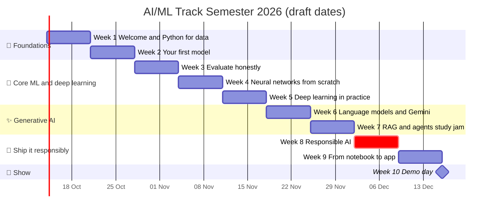
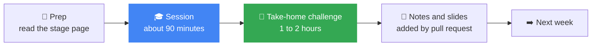

[← Back to AI/ML Track home](../README.md)

<div align="center">

# 📅 Weekly Sessions

**10 weeks · 1 session a week · 1 thing working at the end of each**


[🚀 Start with Week 1](week-01-welcome-and-python-for-data/README.md) · [🧭 Learning path](../learning-path/README.md) · [🏆 Competitions](../competitions/README.md) · [📚 Resources](../resources/README.md)

</div>

---

> [!NOTE]
> Every week folder has the same layout: **goal → objectives → prep → agenda → hands-on → Responsible AI moment → take-home challenge → notes and slides**. Once you know one week, you know them all. Four weeks include a runnable notebook.

## 🗺️ The semester at a glance



> [!TIP]
> Red = the **Responsible AI review** that every project must pass. Dates are a draft and may shift around exams. Changes are announced in the track channel.

---

## 🌱 Phase 1: Foundations

| | Week | Date | Session | You will... | Status |
|:-:|:-:|:-:|---|---|:-:|
| 🐍 | **1** | 14 Oct | **[Welcome and Python for data](week-01-welcome-and-python-for-data/README.md)** | Understand what ML is and explore a dataset in Colab | 🟡 Upcoming |
| 🔢 | **2** | 21 Oct | **[Your first model](week-02-your-first-model/README.md)** | Train a model that reads handwriting and beat a baseline | 🟡 Upcoming |

## 🧠 Phase 2: Core ML and deep learning

| | Week | Date | Session | You will... | Status |
|:-:|:-:|:-:|---|---|:-:|
| ⚖️ | **3** | 28 Oct | **[Evaluate honestly](week-03-evaluate-honestly/README.md)** | Spot overfitting, leakage and the accuracy trap | 🟡 Upcoming |
| 🧬 | **4** | 4 Nov | **[Neural networks from scratch](week-04-neural-networks-from-scratch/README.md)** | Train a neural network with only NumPy, then pitch a project | 🟡 Upcoming |
| 🖼️ | **5** | 11 Nov | **[Deep learning in practice](week-05-deep-learning-in-practice/README.md)** | Fine-tune a pretrained image model on a free GPU | 🟡 Upcoming |

## ✨ Phase 3: Generative AI

| | Week | Date | Session | You will... | Status |
|:-:|:-:|:-:|---|---|:-:|
| 💬 | **6** | 18 Nov | **[Language models and Gemini](week-06-language-models-and-gemini/README.md)** | Prompt well and call the Gemini API safely | 🟡 Upcoming |
| 🔎 | **7** | 25 Nov | **[RAG and agents study jam](week-07-rag-and-agents-study-jam/README.md)** | Build a question-answering bot that cites its sources | 🟡 Upcoming |

## 🚢 Phase 4: Ship it responsibly

| | Week | Date | Session | You will... | Status |
|:-:|:-:|:-:|---|---|:-:|
| 🛡️ | **8** | 2 Dec | **[Responsible AI](week-08-responsible-ai/README.md)** | Write model cards, test fairness slices and red-team a project | 🟡 Upcoming |
| 📦 | **9** | 9 Dec | **[From notebook to app](week-09-from-notebook-to-app/README.md)** | Add tests, build a demo and get a review in the project clinic | 🟡 Upcoming |

## 🎤 Phase 5: Show

| | Week | Date | Session | You will... | Status |
|:-:|:-:|:-:|---|---|:-:|
| 🌟 | **10** | 16 Dec | **[Demo day](week-10-demo-day/README.md)** | Show what you built, reflect, and plan the next semester | 🟡 Upcoming |

**Status key:** 🟡 Upcoming · 🟢 Done · 🔵 Happening now · ⚪ Rescheduled

---

## 🔄 How every week works



<table>
<tr>
<td width="50%" valign="top">

### 🙋 Missed a session?

No problem.

1. Open that week's folder
2. Read the README and run the notebook
3. Finish the challenge
4. Ask in the track channel

Everything you need is in the repo.

</td>
<td width="50%" valign="top">

### ✍️ Adding session notes

After each session, the host (or anyone who took notes) can add slides, links and takeaways to that week's README with a pull request.

See the [contributing guide](../CONTRIBUTING.md) and the [session playbook](../docs/session-playbook.md).

</td>
</tr>
</table>

---

## ✅ Your progress tracker

Copy this into your [Member Roadmap](https://github.com/GDG-TUM/member-roadmaps) issue and tick as you go:

```markdown
- [ ] Week 1: Welcome and Python for data (profile PR merged)
- [ ] Week 2: Your first model
- [ ] Week 3: Evaluate honestly (first Kaggle submission)
- [ ] Week 4: Neural networks from scratch (project pitch given)
- [ ] Week 5: Deep learning in practice (project proposal submitted)
- [ ] Week 6: Language models and Gemini
- [ ] Week 7: RAG and agents study jam
- [ ] Week 8: Responsible AI (model card and review done)
- [ ] Week 9: From notebook to app
- [ ] Week 10: Demo day
```

---

<details>
<summary><b>🧩 Running a new session? Use the template</b></summary>

<br/>

Copy [`_template/README.md`](_template/README.md) into a new folder named `week-NN-short-title/` and fill it in.

Keep each session to one idea, one demo and one challenge small enough to finish in 1 to 2 hours. The [session playbook](../docs/session-playbook.md) walks through planning, running and following up.

</details>

<div align="center">

*Learn. Build. Ship. Responsibly.* 🤖

</div>
