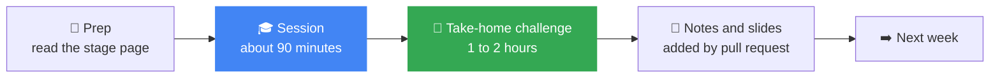

[← Back to AI/ML Track home](../README.md)

<div align="center">

# 📅 Weekly Sessions

**Phase 1: 6 weeks · 1 session a week · 1 thing working at the end of each**


[🚀 Start with Week 1](week-01-welcome-and-python-for-data/README.md) · [🧭 Learning path](../learning-path/README.md) · [🏆 Competitions](../competitions/README.md) · [📚 Resources](../resources/README.md)

</div>

---

> [!NOTE]
> Every week folder has the same layout: **goal → objectives → prep → agenda → hands-on → Responsible AI moment → take-home challenge → notes and slides**. Once you know one week, you know them all. Phase 1 weeks also open with **💡 Why this matters**.

## 🗺️ The plan at a glance

Weeks are a sequence, not calendar dates. Session times and venues are posted in the track channel.

```mermaid
flowchart LR
    subgraph P1[🌱 Phase 1: How machines learn]
        direction LR
        W1[1 · Data] --> W2[2 · First model] --> W3[3 · Evaluate honestly] --> W4[4 · Neural nets from scratch] --> W5[5 · Deep learning in practice] --> W6[6 · Showcase]
    end
    subgraph P2[🚢 Phase 2: Build with AI, draft]
        direction LR
        W7[7 · LLMs and Gemini] --> W8[8 · RAG and agents] --> W9[9 · Responsible AI] --> W10[10 · Notebook to app] --> W11[11 · Demo day]
    end
    P1 --> P2
    style W6 fill:#34A853,color:#fff,stroke:#34A853
    style W9 fill:#EA4335,color:#fff,stroke:#EA4335
    style W11 fill:#34A853,color:#fff,stroke:#34A853
```



> [!TIP]
> Green = the two finish lines (the Phase 1 showcase and demo day). Red = the **Responsible AI review** every team project must pass. See the [roadmap](../roadmap/semester-roadmap.md) for why the plan is shaped this way.

---

## 🌱 Phase 1: How machines learn (weeks 1 to 6)

Three fields only: **📊 Data**, **🧮 Classical ML** and **🧠 Neural networks**.

| | Week | Field | Session | You will... | Status |
|:-:|:-:|---|---|---|:-:|
| 🐍 | **1** | 📊 Data | **[Welcome and Python for data](week-01-welcome-and-python-for-data/README.md)** | Understand what ML is and explore a dataset in Colab | 🟡 Upcoming |
| 🔢 | **2** | 🧮 Classical ML | **[Your first model](week-02-your-first-model/README.md)** | Train a model that reads handwriting and beat a baseline | 🟡 Upcoming |
| ⚖️ | **3** | 🧮 Classical ML | **[Evaluate honestly](week-03-evaluate-honestly/README.md)** | Spot overfitting, leakage and the accuracy trap | 🟡 Upcoming |
| 🧬 | **4** | 🧠 Neural networks | **[Neural networks from scratch](week-04-neural-networks-from-scratch/README.md)** | Train a neural network with only NumPy, then start a mini-project | 🟡 Upcoming |
| 🖼️ | **5** | 🧠 Neural networks | **[Deep learning in practice](week-05-deep-learning-in-practice/README.md)** | Fine-tune a pretrained image model on a free GPU | 🟡 Upcoming |
| 🎤 | **6** | All three | **[Phase 1 showcase](week-06-phase-1-showcase/README.md)** | Present your mini-project and explain why you trust it | 🟡 Upcoming |

## 🚢 Phase 2: Build with AI (weeks 7 to 11, draft)

Finalised after the Phase 1 retrospective.

| | Week | Session | You will... | Status |
|:-:|:-:|---|---|:-:|
| 💬 | **7** | **[Language models and Gemini](week-07-language-models-and-gemini/README.md)** | Prompt well, call the Gemini API safely, pitch a team project | ⚪ Draft |
| 🔎 | **8** | **[RAG and agents study jam](week-08-rag-and-agents-study-jam/README.md)** | Build a question-answering bot that cites its sources | ⚪ Draft |
| 🛡️ | **9** | **[Responsible AI](week-09-responsible-ai/README.md)** | Write model cards, test fairness slices and red-team a project | ⚪ Draft |
| 📦 | **10** | **[From notebook to app](week-10-from-notebook-to-app/README.md)** | Add tests, build a demo and get a review in the project clinic | ⚪ Draft |
| 🌟 | **11** | **[Demo day](week-11-demo-day/README.md)** | Show what you built, reflect, and plan what comes next | ⚪ Draft |

**Status key:** 🟡 Upcoming · 🟢 Done · 🔵 Happening now · ⚪ Draft (still being planned)

---

## 🔄 How every week works



<table>
<tr>
<td width="50%" valign="top">

### 🙋 Missed a session?

No problem.

1. Open that week's folder
2. Read the README and run the notebook
3. Finish the challenge
4. Ask in the track channel

Everything you need is in the repo.

</td>
<td width="50%" valign="top">

### ✍️ Adding session notes

After each session, the host (or anyone who took notes) can add slides, links and takeaways to that week's README with a pull request.

See the [contributing guide](../CONTRIBUTING.md) and the [session playbook](../docs/session-playbook.md).

</td>
</tr>
</table>

---

## ✅ Your progress tracker

Copy this into your [Member Roadmap](https://github.com/GDG-TUM/member-roadmaps) issue and tick as you go:

```markdown
Phase 1: How machines learn
- [ ] Week 1: Welcome and Python for data (profile PR merged)
- [ ] Week 2: Your first model
- [ ] Week 3: Evaluate honestly (first Kaggle submission)
- [ ] Week 4: Neural networks from scratch (mini-project pair and dataset chosen)
- [ ] Week 5: Deep learning in practice
- [ ] Week 6: Phase 1 showcase (mini-project presented)

Phase 2: Build with AI
- [ ] Week 7: Language models and Gemini (team project proposed)
- [ ] Week 8: RAG and agents study jam
- [ ] Week 9: Responsible AI (model card and review done)
- [ ] Week 10: From notebook to app
- [ ] Week 11: Demo day
```

---

<details>
<summary><b>🧩 Running a new session? Use the template</b></summary>

<br/>

Copy [`_template/README.md`](_template/README.md) into a new folder named `week-NN-short-title/` and fill it in.

Keep each session to one idea, one demo and one challenge small enough to finish in 1 to 2 hours. The [session playbook](../docs/session-playbook.md) walks through planning, running and following up.

</details>

<div align="center">

*Learn. Build. Ship. Responsibly.* 🤖

</div>
